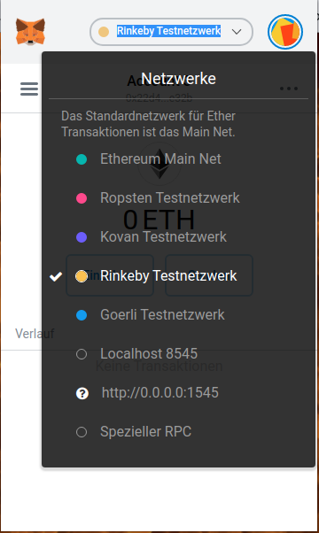

# Create Wallet

## Step 1: Open your Chrome Browser 

## Step 2: Enter the URL metamask.io

## Step 3: Click the "GET CHROME EXTENSION" link

## Step 4: Now Add the metamask extension to your browser

## Step 5: Approve the action

## Step 6: Now click the "Get started" to create an account

## Step 7: Choose "Create a Wallet"

## Step 8: Choose any of the option as your choice "No Thanks" or "I agree"

## Step 9: Create a strong password

## Step 10: Store your secret backup phrase

## Step 11: Step to switch to test network

## Step 12: Select "Rinkeby Test Network"

